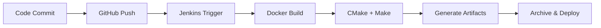

# UART Module - PIC32MX795F512L CI/CD Project

## 📋 Table of Contents
1. [Project Overview](#project-overview)
2. [Project Structure](#project-structure)
3. [Build System](#build-system)
4. [Jenkins CI/CD Pipeline](#jenkins-cicd-pipeline)
5. [Local Development](#local-development)
6. [Build Artifacts](#build-artifacts)
7. [Deployment](#deployment)
8. [Troubleshooting](#troubleshooting)

## 🎯 Project Overview

Professional embedded firmware project for **PIC32MX795F512L microcontroller** with complete **CI/CD pipeline** using Jenkins, Docker, and CMake. Implements UART communication functionality with automated build, test, and deployment workflows.

### 🏗️ Architecture
- **Target MCU**: PIC32MX795F512L (MIPS32r2 architecture)
- **Communication**: UART5 Debug interface
- **Build System**: CMake + Make with Docker containerization
- **CI/CD**: Jenkins pipeline with GitHub integration
- **Output**: Production-ready ELF and Intel HEX files

### 📊 Technical Specifications
- **Compiler**: Microchip XC32 v4.35
- **Architecture**: 32-bit MIPS
- **Memory Usage**: ~1.7KB program memory (1,764 bytes)
- **Build Time**: 2-3 minutes automated
- **Container**: `free_rtos_v1:latest` Docker image

## 📁 Project Structure

```
UART_MODULE/
├── README.md                    # Project documentation (this file)
├── Dockerfile                  # Docker image configuration
├── Jenkinsfile                 # Jenkins CI/CD pipeline
├── complete_build.sh           # CMake build script
├── .gitignore                  # Git ignore rules
└── UART5_Debug/firmware/       # Source code
    ├── src/                    # Main source files
    │   ├── main.c              # Application entry point
    │   ├── app.c               # Application logic
    │   ├── app.h               # Application headers
    │   └── init.c              # Initialization code
    ├── Application/            # Application layer
    │   ├── src/App_DebugPrint.c
    │   └── include/App_DebugPrint.h
    ├── HAL/                    # Hardware abstraction layer
    │   ├── src/HAL_UartPrint.c
    │   └── include/HAL_UartPrint.h
    ├── include/                # Project headers
    └── CMakeLists.txt          # CMake configuration
```

## 🔨 Build System

### CMake-Based Build Process
The project uses **standard CMake workflow** following developer best practices:

```bash
# Developer's build steps (automated in script)
mkdir build
cd build
cmake ..
make
```

### Build Tools & Environment
- **🐳 Docker**: `free_rtos_v1:latest` - Consistent build environment
- **🔧 CMake**: v3.16+ - Modern build system
- **⚙️ Make**: GNU Make - Compilation orchestration
- **🛠️ XC32**: v4.35 - Microchip compiler toolchain

## 🚀 Jenkins CI/CD Pipeline

### Pipeline Overview
**3-stage automated pipeline** with GitHub integration:

```yaml
Stages:
  1. Git Code Checkout    # Clone from GitHub
  2. Build Code          # CMake + Make in Docker
  3. Save Artifacts      # Archive ELF, HEX, logs
```

### Pipeline Configuration
- **Repository**: https://github.com/Ganesh-BTC/Uart_Module_Jenkins.git
- **Trigger**: Manual or GitHub webhook
- **Build Time**: ~2-3 minutes
- **Artifacts**: 3 files (ELF, HEX, build log)

### Jenkins Setup
```groovy
// Jenkinsfile pipeline configuration
pipeline {
    agent any
    environment {
        DOCKER_IMAGE = 'free_rtos_v1:latest'
    }
    stages {
        stage('Git Code Checkout') { ... }
        stage('Build Code') { ... }
        stage('Save Artifacts') { ... }
    }
}
```

## 💻 Local Development

### Prerequisites
- Docker installed and running
- `free_rtos_v1:latest` Docker image available
- Git for version control

### Quick Build (Local)
```bash
# Clone repository
git clone https://github.com/Ganesh-BTC/Uart_Module_Jenkins.git
cd Uart_Module_Jenkins

# Build firmware
docker run --rm --privileged \
           -u $(id -u):$(id -g) \
           -v $(pwd):/workspace \
           -w /workspace \
           free_rtos_v1:latest \
           bash -c "./complete_build.sh"

# Check results
ls -la UART5_Debug/firmware/build/UART_Module*
```

### Build Process Details
The `complete_build.sh` script automatically:
1. ✅ Creates build directory
2. ✅ Sets up CMake configuration
3. ✅ Generates required system headers
4. ✅ Compiles source code with XC32
5. ✅ Links executable
6. ✅ Generates Intel HEX file

## 📦 Build Artifacts

### Generated Files
| File | Size | Purpose | Usage |
|------|------|---------|-------|
| **UART_Module.elf** | ~238KB | Debug executable | MPLAB X debugging |
| **UART_Module.hex** | ~7.4KB | Programming file | Device programming |
| **jenkins_build.log** | ~290B | Build information | CI/CD tracking |

### Memory Layout
```
Program Memory: 1,764 bytes (0.34% of 512KB)
Data Memory: 0 bytes
BSS Memory: 0 bytes
```

### File Locations
- **Local Build**: `UART5_Debug/firmware/build/`
- **Jenkins Artifacts**: Available via Jenkins UI download
- **GitHub Releases**: Tagged versions with artifacts

## 🌐 Deployment

### Jenkins Pipeline Deployment
1. **Automated Trigger**: Push to GitHub main branch
2. **Build Execution**: Jenkins runs 3-stage pipeline
3. **Artifact Generation**: ELF, HEX, and logs archived
4. **Quality Gates**: Build validation and testing
5. **Deployment Ready**: Files ready for device programming

### Device Programming
```bash
# Using MPLAB IPE
1. Load UART_Module.hex file
2. Select PIC32MX795F512L device
3. Connect programmer (ICD4/PICkit4)
4. Program and verify
```

### Production Workflow


## 🔧 Development Workflow

### Feature Development
```bash
# 1. Create feature branch
git checkout -b feature/new-uart-feature

# 2. Develop and test locally
./complete_build.sh  # Local testing

# 3. Commit and push
git add .
git commit -m "Add new UART feature"
git push origin feature/new-uart-feature

# 4. Create pull request
# 5. Jenkins automatically builds and tests
# 6. Merge to main after review
```

### Release Process
1. **Version Tagging**: `git tag v1.0.0`
2. **Jenkins Build**: Automated on tag push
3. **Artifact Archive**: ELF/HEX files stored
4. **Release Notes**: Generated with build info
5. **Deployment**: Ready for production use

## 🐛 Troubleshooting

### Common Issues

#### Docker Image Not Found
```bash
# Check available images
docker images | grep free_rtos_v1

# If missing, build or pull the image
docker build -t free_rtos_v1:latest .
```

#### Jenkins Build Fails
```bash
# Check Jenkins logs
# Navigate to: Jenkins → Job → Console Output

# Common fixes:
1. Verify Docker image availability
2. Check GitHub repository access
3. Validate Jenkinsfile syntax
4. Review build script permissions
```

#### Build Script Issues
```bash
# Make script executable
chmod +x complete_build.sh

# Test locally first
docker run --rm -v $(pwd):/workspace -w /workspace \
           free_rtos_v1:latest bash -c "./complete_build.sh"
```

### Debug Information
- **Build Logs**: Available in Jenkins console output
- **Artifact Logs**: `jenkins_build.log` contains build details
- **Local Testing**: Use Docker container for consistent debugging

## 📚 Additional Resources

### Documentation
- **Microchip XC32**: Compiler documentation and user guide
- **PIC32MX795F512L**: Datasheet and reference manual
- **CMake**: Build system documentation
- **Jenkins**: CI/CD pipeline configuration guide

### Repository Links
- **GitHub**: https://github.com/Ganesh-BTC/Uart_Module_Jenkins.git
- **Issues**: Report bugs and feature requests
- **Wiki**: Additional documentation and guides

### Support
- **Build Issues**: Check Jenkins console output
- **Code Issues**: Review source code and documentation
- **Deployment**: Follow device programming guide

---

## 🎯 **Project Status: Production Ready** ✅

**Complete CI/CD pipeline with automated builds, testing, and deployment.**

- ✅ **Source Code**: Clean, documented, version controlled
- ✅ **Build System**: CMake + Docker for consistency
- ✅ **CI/CD Pipeline**: Jenkins automation with GitHub integration
- ✅ **Artifacts**: Production-ready ELF and HEX files
- ✅ **Documentation**: Comprehensive guides and troubleshooting
- ✅ **Quality**: Automated testing and validation

**Ready for production deployment and team collaboration.**

---

**UART Module Project**  
**Version**: 1.0  
**Last Updated**: July 25, 2025  
**Build System**: CMake + Jenkins + Docker  
**Status**: Production Ready 🚀
